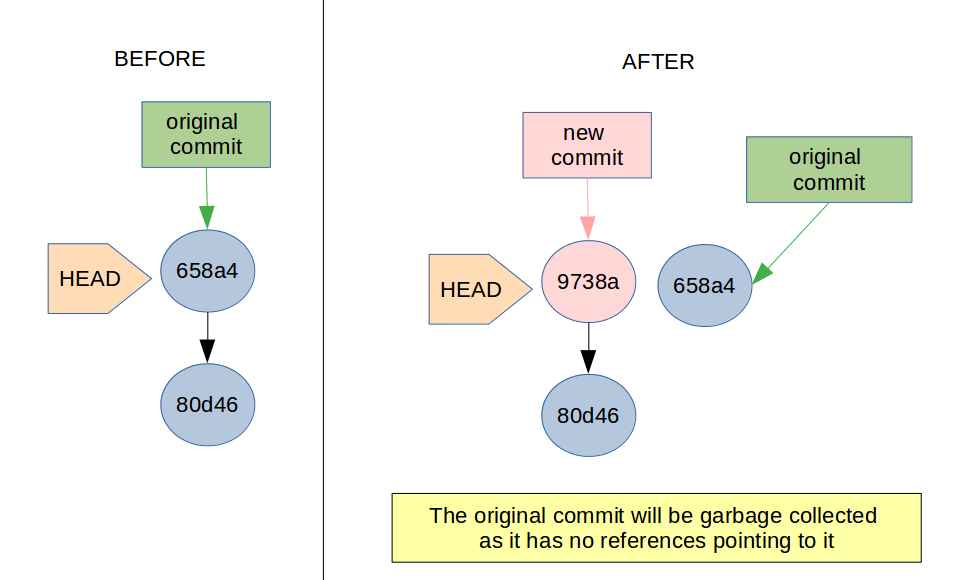

In this part, we will learn about *amend* and *cherry-pick*. I use *amend* almost daily. *Cherry-pick* is pretty useful and asked in interviews at times.

### Amend
Makes changes to the most recent commit.

**Caution**: Use on a **Local** commit since *amend* rewrites the history of commits. 

#### When does *amend* come to the rescue?
+ Adding files you forgot to commit
+ Removing files you commit by mistake
+ Editing the commit message

#### How does it work?

*Amend* removes the old commit and adds a new one. HEAD now points to the new commit.

Let's look at the commands in action. I urge you to try these out on a local repo to get a better understanding. Except for [git](https://git-scm.com/book/en/v2/Getting-Started-Installing-Git), no installations are necessary.

Congratulations on reaching the end. 🎉 To get notified about other posts in this series,

<form name="collect-email" method="POST" data-netlify="true">
<input type="hidden" name="form-name" value="collect-email" />
  

    <label>Name <input type="text" name="name" /></label>
  

  

    <label>Email <input type="email" name="email" /></label>
  

  

    <button type="submit">Send</button>
  

</form>
