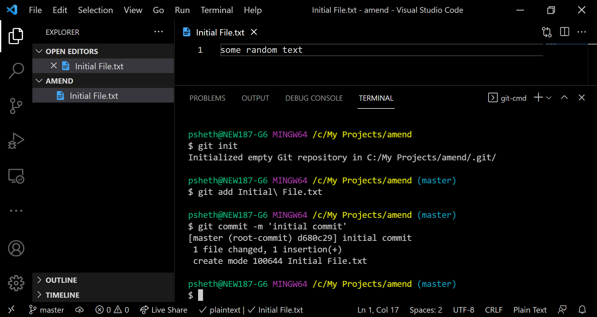
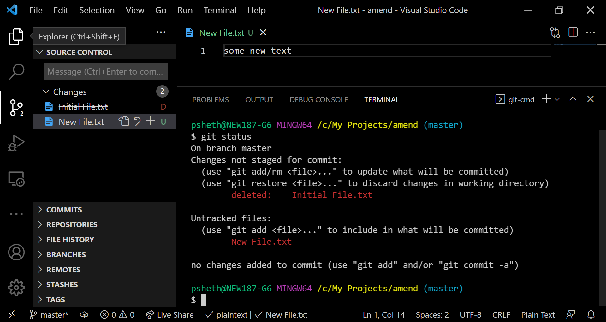
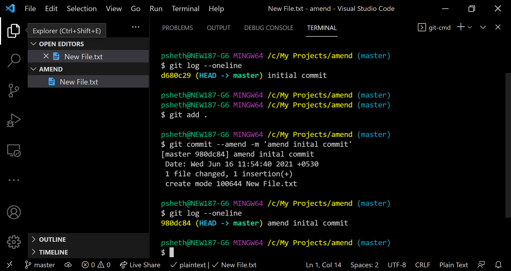
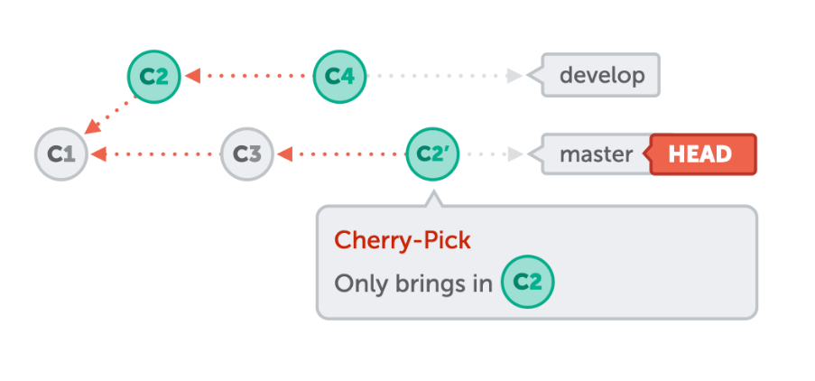
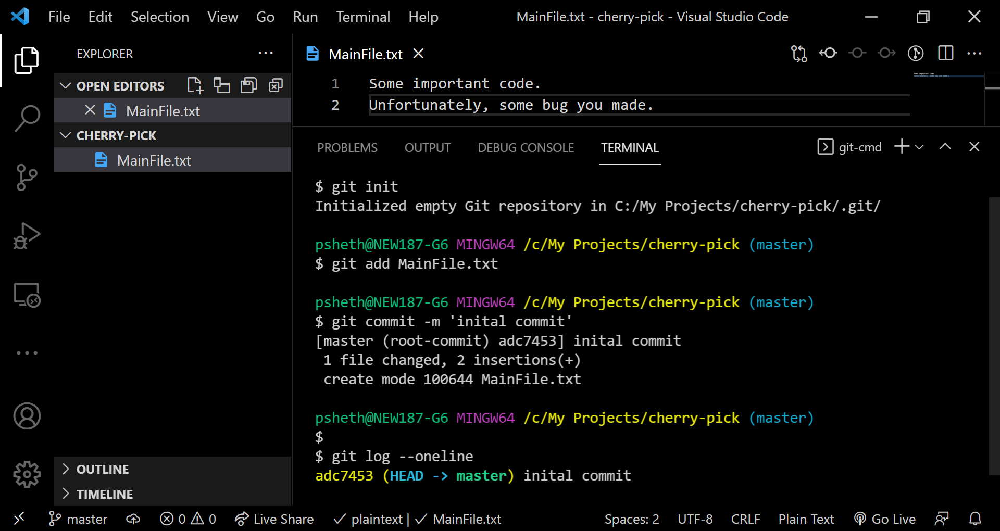
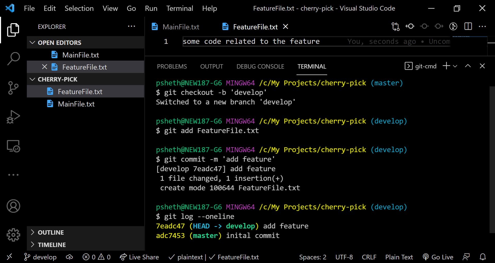
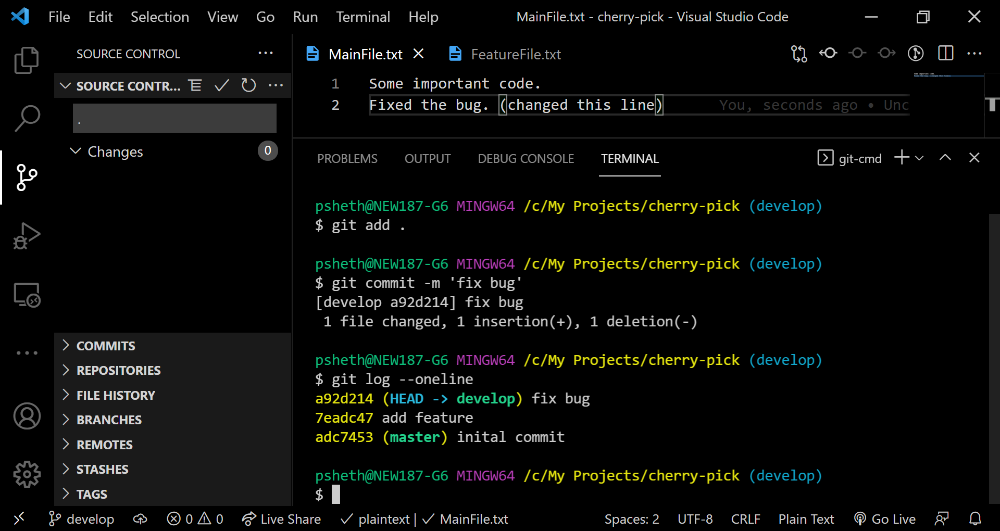
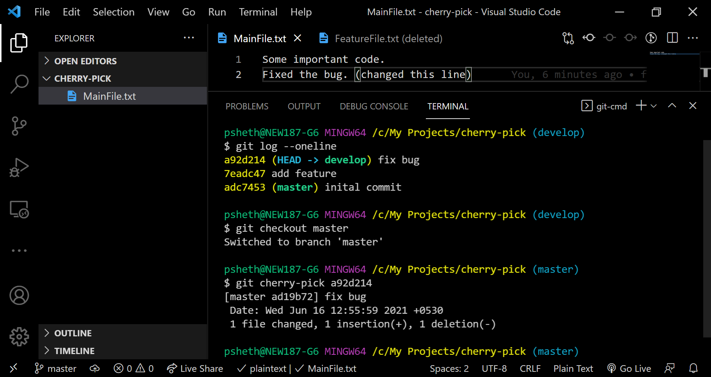

In this part, we will learn about *amend* and *cherry-pick*. I use *amend* almost daily. *Cherry-pick* is pretty useful and asked in interviews at times.

## amend
Makes changes to the most recent commit.

**Caution**: Use on a **Local** commit since *amend* rewrites the history of commits. 

#### When does *amend* come to the rescue?
+ Adding files you forgot to commit
+ Removing files you commit by mistake
+ Editing the commit message 

#### How does it work?

*Amend* removes the old commit and adds a new one. HEAD then points to the new commit.

### Try it yourself
Let's look at the command in action. I urge you to try these steps out on a local repo to get a better understanding. Except for [git](https://git-scm.com/book/en/v2/Getting-Started-Installing-Git), no installations are necessary. I am using [VS code](https://code.visualstudio.com/), however, these commands can be run directly in the terminal.

1. Create a folder. And a file with some initial text.
2. Open git bash or terminal in that folder and run `git init` in the folder to initialize a git repository.
3. Add and commit changes.

4. We will now modify this initial commit. Add a new file and delete the current file.

5. Stage the changes using `git add .`
6. Commit changes using `git commit --amend -m 'amend initial commit'` Notice that the previous commit *d680c29* is replaced with the new one *980dc84*.

 

**Note**:  To retain the commit message, use `git commit --amend --no-edit`

## cherry-pick
Picks commits from other branches and adds them to the current branch. It creates duplicate commits.

#### Situations where *cherry-pick* is useful:

+ Team Collaboration - when you want to use code in a particular commit on someone's branch without merging their branch into yours. *Cherry-pick* that commit onto your branch.
+ Bug hotfixes - when master branch has a bug that needs to be fixed immediately and is already fixed on develop.*Cherry-pick* the commit on master from develop.

#### How *cherry-pick* works:

#### Try it yourself
Time to look at the command in action. Again, please try these steps out on a local repo to get a better understanding. It takes hardly 10 mins.

1. Create a folder. And a file with some initial text.
2. Open git bash or terminal in that folder and run `git init` in the folder to initialize a git repository.
3. Add and commit changes.

4. Create a new branch 'develop' using `git checkout -b 'develop'`
5. Add a new file, stage the changes and commit.

6. Assume that you found the bug in the *MainFile* and fix it. Just update some text in the *MainFile* and commit the change in 'develop'.

7. Time to *cherry-pick* the last commit (bugfix) from 'develop' to 'master'. Go to 'master' branch with `git checkout master`.

8. Execute `git cherry-pick <commit sha>`. It's `a92d214` in this case. On 'develop' run `git log --oneline` to know the 'commit sha'

 

**Note**: To avoid creating a new commit, but get the changes of a particular commit, use the `--no-commit` option with *cherry-pick*. Similarly, `--edit` can be used to edit the commit message.

#### References:
+ https://www.git-tower.com/learn/git/ebook/
+ https://www.atlassian.com/git/tutorials
+ https://git-scm.com/docs/

Congratulations on reaching the end. 🎉 To get notified about other posts in this series,

<form name="collect-email" method="POST" data-netlify="true">
<input type="hidden" name="form-name" value="collect-email" />
  

    <label>Name <input type="text" name="name" /></label>
  

  

    <label>Email <input type="email" name="email" /></label>
  

  

    <button type="submit">Send</button>
  

</form>
