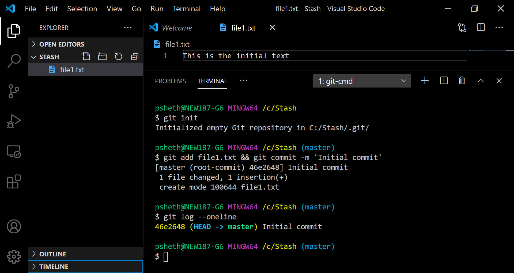
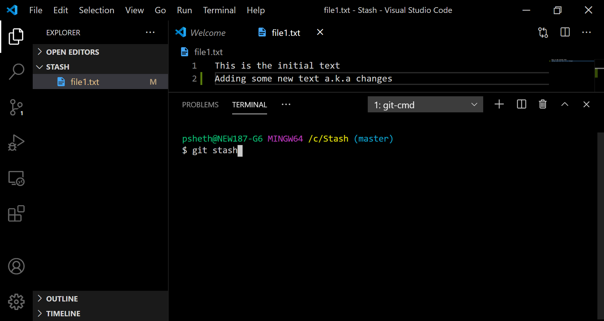
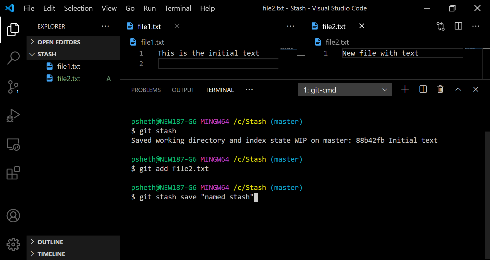
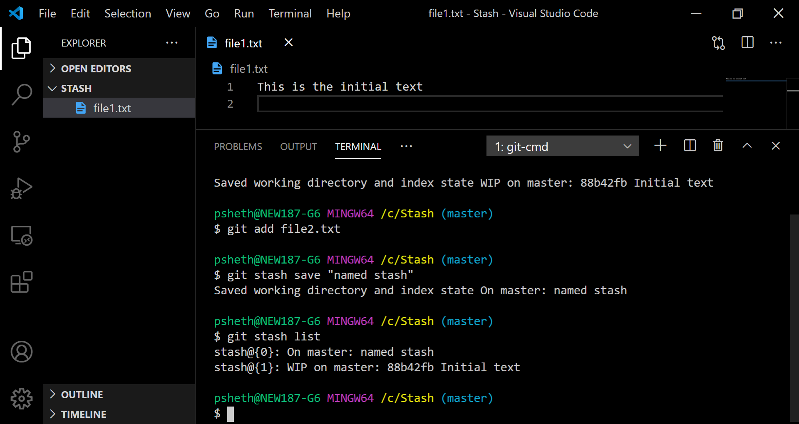
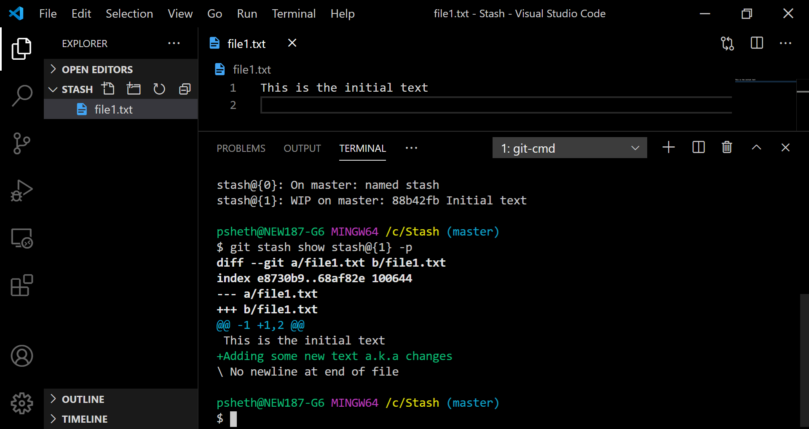
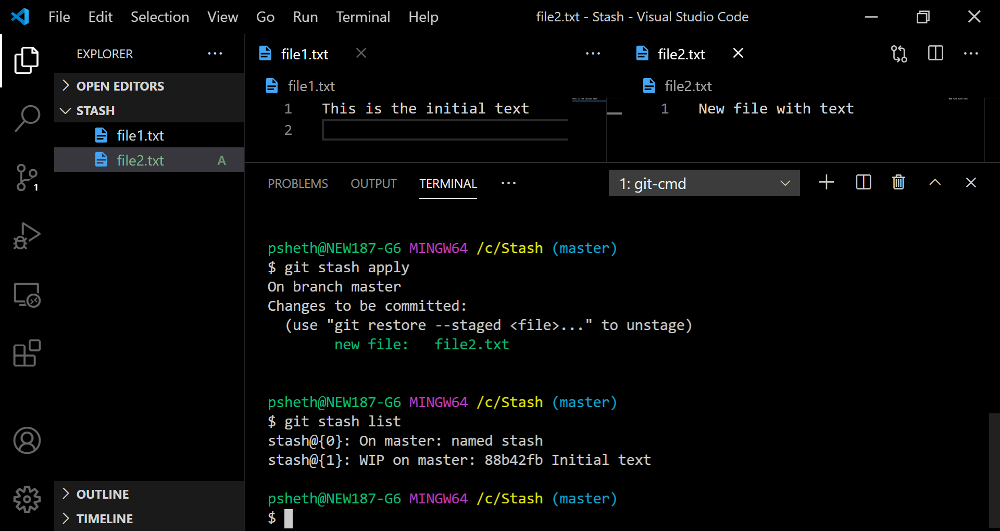
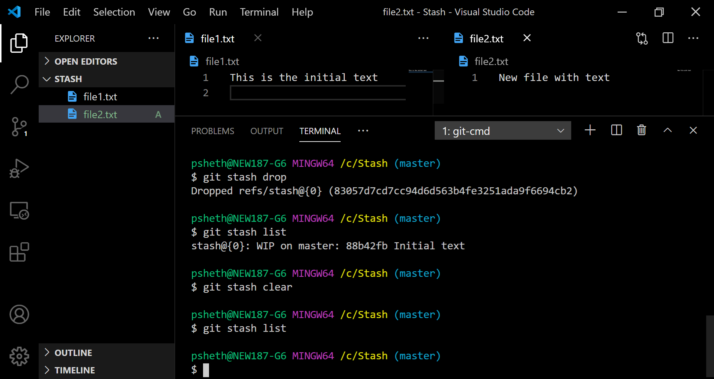

Do you find git daunting when you have to run any command other than the common ones? Do you face a fear of messing up like never before? This blog series will help you fight that fear.

When we go wrong, we follow the steps mentioned in the meme, which include saving our work and downloading a fresh copy. 🙃 While this seems like a good "jugaad" (hack), it becomes tedious. However, there is always a better solution.

Let's start with a simple command which will be useful in some such scenarios.

### Stash

A glance at what the [Pro Git](https://git-scm.com/book/en/v2) book written by Scott Chacon and Ben Straub says

> Stashing takes the dirty state of your working directory — that is, your modified tracked files and staged
> changes — and saves it on a stack of unfinished changes that you can reapply at any time (even on a different branch).

Right..... Okay...... But, what does this mean? 🤔

Well, a real-world analogy would be helpful here.

Think of stashing as placing all your valuable changes safely in a box.
When filling a box, you add new items on top of each other. Similarly, changes of subsequent stashes get added on top like a stack.

We tend to cram stuff when packing.🙂 However, everything in a stash is neatly stacked and indexed in a well-organized manner. You can pull out changes from any index without affecting the rest.

Cool. Right? 🤩

Let's look at the commands in action. I urge you to try these out on a local repo to get a better understanding. Except for [git](https://git-scm.com/book/en/v2/Getting-Started-Installing-Git), no installations are necessary.

1. Create a folder. And a file with some initial text.
2. Open git bash or terminal in that folder and run `git init` in the folder to initialize a git repository.
3. Add and commit changes.

   

4. Time for stashing now. Add some new text in your file.

   

5. Run `git stash` to stash the changes.
6. Create a new file with some text and add it for git to track it.

   

7. Stash using `git stash save "named stash"` to save the stash with a name this time.

8. Now view a list of stashes made with guess what? 🙃 `git stash list`.

   

9. Get more details of each stash with `git stash show stash{1} -p`.

   

10. Run `git stash apply` to apply the most recently saved changes on your working directory.

    

11. Changes will still be present on the stash. Run `git stash drop` to drop them. Alternately, `git stash pop` can be used to apply and drop changes using a single command.

12. Use `git stash clear` to remove all changes from the stash without applying them.

    

**Note:** Index can be specified as `stash@{1}` with `apply` and `drop`. By default, they operate on the most recent stash present on the top.

Stashing acts as a lifeline when we need changes in the future. A few cases are listed :

- Imagine that, to work on a feature for a project, you clone the repository and create your branch and start working. Somebody else's PR gets accepted and merged having code useful for you too. Now what? Stash your current changes, fetch the new changes from the remote, and finally apply the stashed content.
- Another such scenario is when you forget some change on your old commit and already start working on a new one. Complete the work on the previous commit by stashing changes for later.
- Let's suppose you are working on branch A. You commit your work and move on to making changes for another branch B. But, then realize that you forgot to switch to branch B in your excitement. Stashing will solve the problem here.
